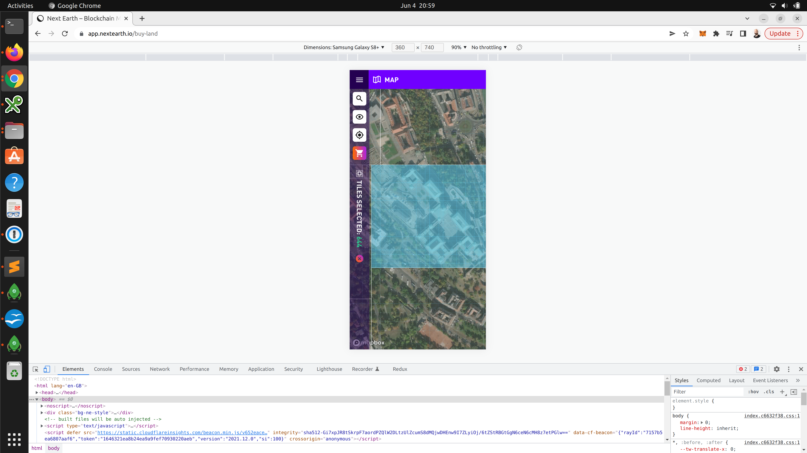
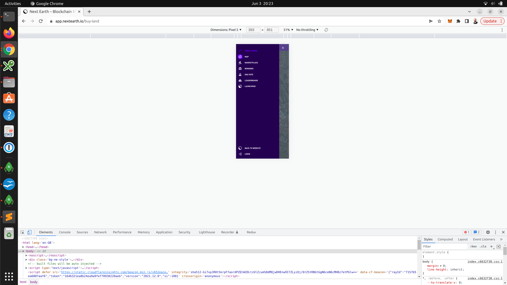

```
npm i
npm start
```


This project is all about implementing the side menus.
There are 2 menus:
 - the burger button to switch from the map page to other pages like the marketplace, etc...
 - the translucid left side bar menu that is used to interact with the map

This project is not about implementing the interactions, but just the menus themselves.
NOTE: You can add a button on the bottom right of the screen and any click on that button would simulate selecting a land. (Again this is only about implementing the menus not the interactions)


## translucid menu:

Selecting a land (OR clicking on your button) would display the number of the selected tile on the side bar

Clicking the circled red button would expend the translucid menu:


Mobile when nothing is selected




Clicking on the left sided arrow would close the menu.

## The burger button

the burger button display a menu to go to different pages. It expand like this on mobile:


