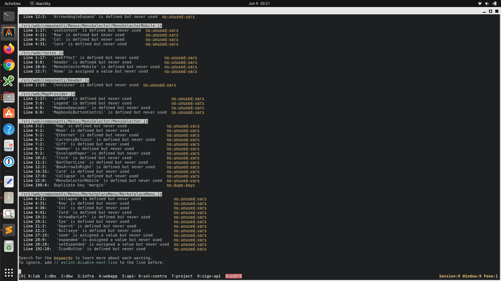
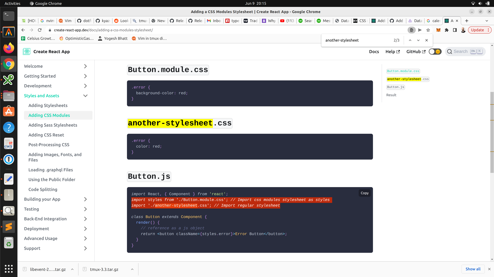
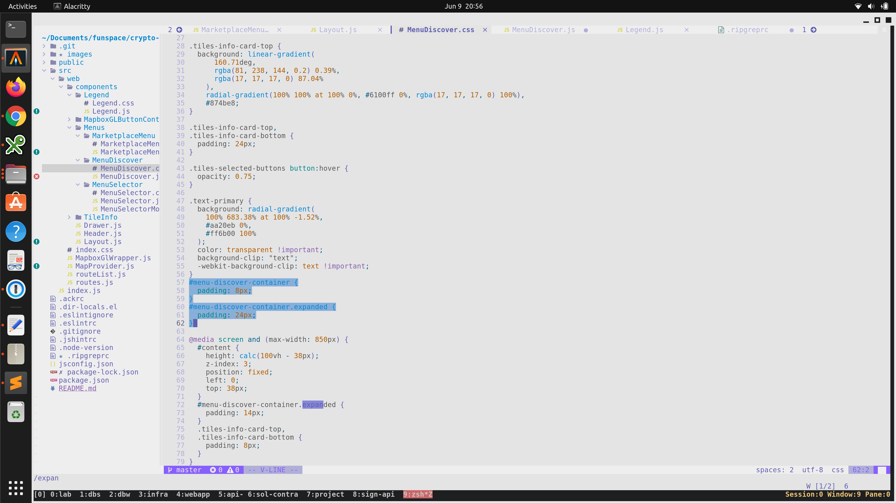
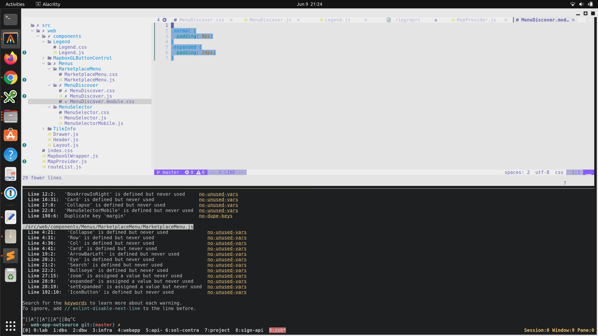
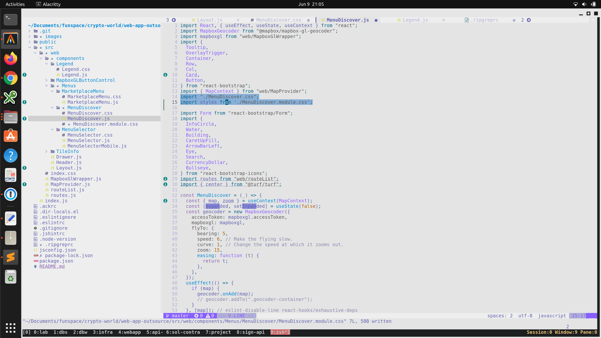
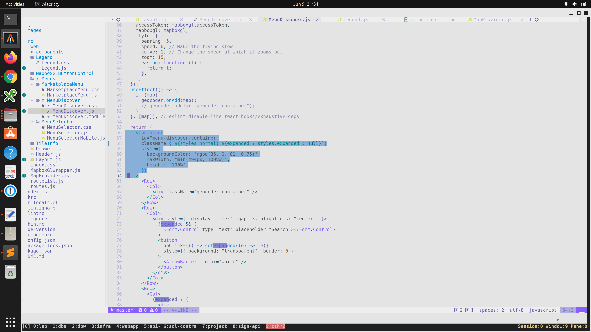
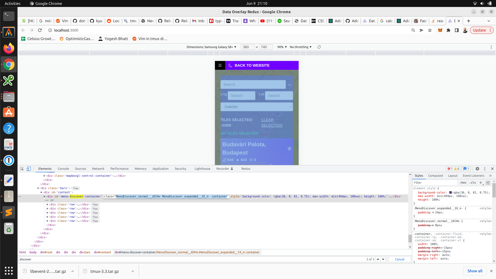
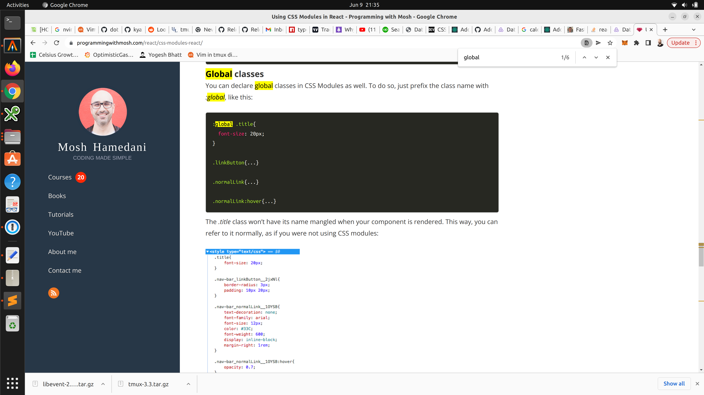

```
npm i
npm start
```

## step2

- warnings
- css modules


## warnings

Let try to remove as many warnings as possible.
This is going to reduce the number of unused code and will ease the transition to CSS Modules



## css modules

Basically a file named Component.module.css is going to be treated as a css modules
As you can see on the doc you can have another-stylesheet and css modules living together at the same time 


CSS Modules does not work with css id targeting (only classes)
So you will transition those 2 css rules

Into class rules on a file named Component.module.css


You can import both the normal css and the css module to transition step by step, everything to css modules
```
import styles from './MenuDiscover.module.css';
```
will create a variable named `styles` that will be used later on the `className` attribute


The `styles` variable is used to fill the `className` attribute
NOTE: This can create `null` classnames when we do conditional classnames. We will ignore that for now


The change should be reflected in the html.
You must start seeing attributes like this `class="MenuDiscover_normal__iDlHv MenuDiscover_expanded__1X_n- container"`


We need to migrate the entire application to css modules
This commit give you an idea of what I explained in the doc before: https://github.com/johhnsmmith198/web-app-outsource/commit/540061b6f6169370dde07e44883aedec9c85abe3

NOTE: 
In case you have globals. You can prefix the class with `:globals`.
Those globals should be defined at the to level and imported via absolute path
example: `import globalStyles from 'web/globals.module.css'`


## map provider

will come next (in a step3, depending on how we go with the css refactoring). lets focus on css modules first.


